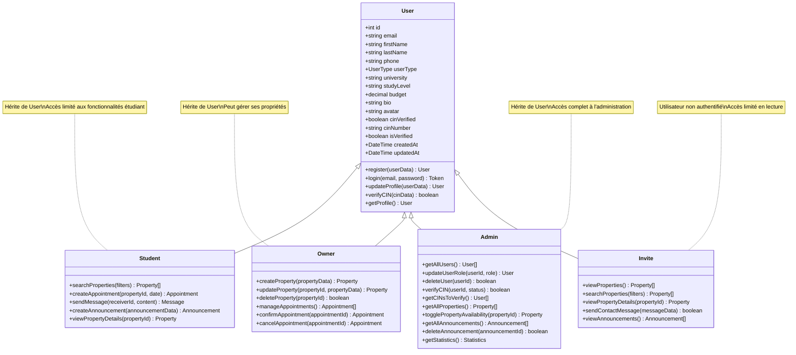
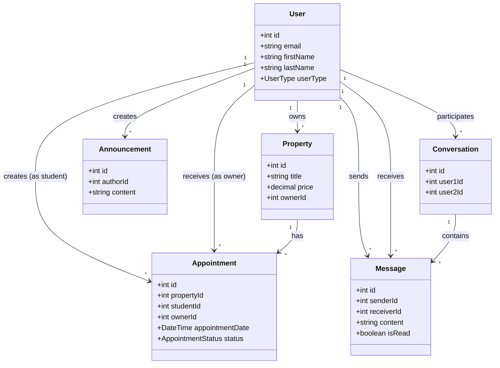
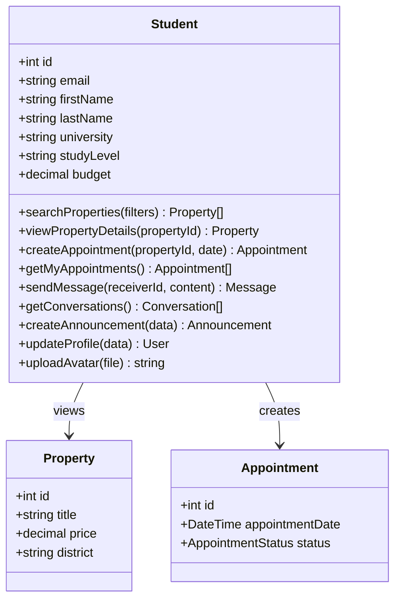
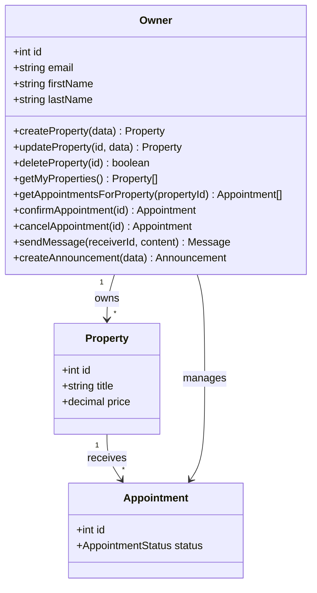
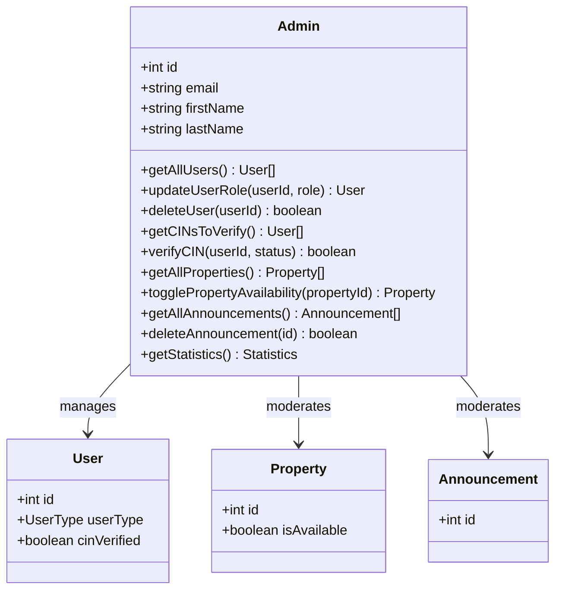
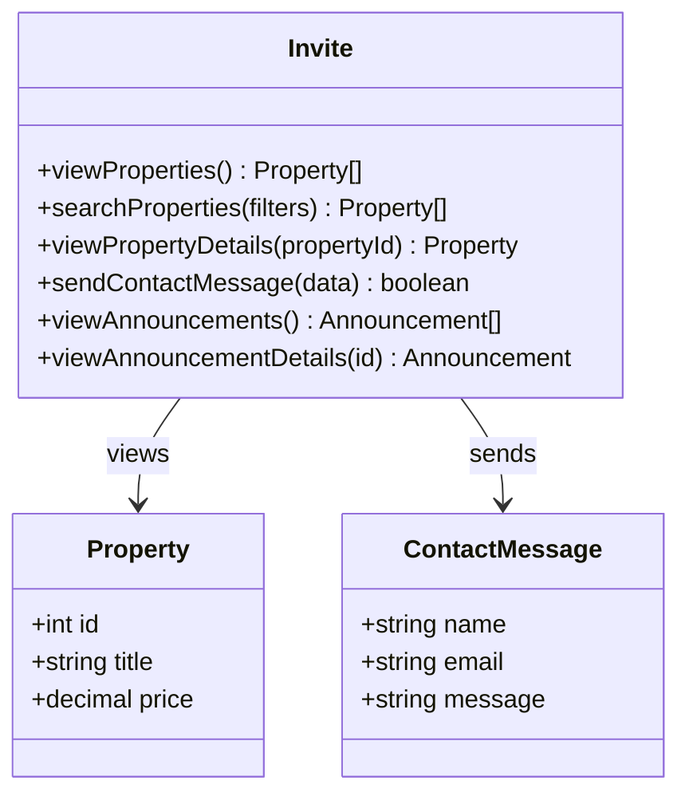

# Diagrammes de Classe de Conception - Utilisateurs uniquement

## Diagramme de Classe Principal (Utilisateurs)

## Diagramme de Classe - Relations Utilisateurs

## Diagramme de Classe - Vues par Rôle

### Vue Étudiant

### Vue Propriétaire

### Vue Administrateur

### Vue Invité

