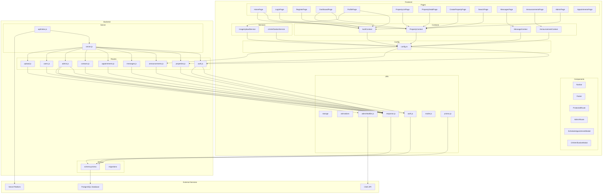

# Diagramme de Paquetage - Plateforme Coloc Antananarivo

## Structure des Paquetages

## Description des Paquetages

### Frontend

#### Pages
Contient toutes les pages de l'application React :
- Pages publiques : HomePage, LoginPage, RegisterPage
- Pages protégées : DashboardPage, ProfilePage, PropertyListPage, etc.
- Pages admin : AdminPage

#### Components
Composants réutilisables :
- Navigation : Navbar, Footer
- Sécurité : ProtectedRoute, AdminRoute
- Modales : ScheduleAppointmentModal, CINVerificationModal

#### Contexts
Gestion d'état global avec React Context :
- AuthContext : Authentification et profil utilisateur
- PropertyContext : Gestion des propriétés
- MessageContext : Messagerie
- AnnouncementContext : Annonces

#### Services
Services pour les opérations externes :
- imageUploadService : Upload d'images
- cinVerificationService : Vérification CIN

### Backend

#### Routes
Routes API Express organisées par domaine :
- auth.js : Authentification
- properties.js : Gestion des propriétés
- announcements.js : Gestion des annonces
- messages.js : Messagerie
- appointments.js : Rendez-vous
- contacts.js : Messages de contact
- admin.js : Administration
- users.js : Gestion utilisateurs
- upload.js : Upload de fichiers

#### Utils
Utilitaires backend :
- auth.js : Vérification JWT, gestion tokens
- response.js : Formatage des réponses API
- adminNotifier.js : Notifications admin
- mailer.js : Envoi d'emails
- prisma.js : Client Prisma

#### Prisma
ORM et schéma de base de données :
- schema.prisma : Définition des modèles
- migrations : Migrations de base de données

### External Services

#### PostgreSQL Database
Base de données relationnelle pour le stockage des données

#### Clerk API
Service d'authentification externe (optionnel)

#### Vercel Platform
Plateforme de déploiement serverless

## Dépendances entre Paquetages

1. **Frontend → Backend** : Communication via API REST
2. **Backend Routes → Utils** : Utilisation des utilitaires
3. **Backend Utils → Prisma** : Accès à la base de données
4. **Prisma → PostgreSQL** : Connexion à la base de données
5. **Backend → Clerk** : Authentification externe
6. **Backend → Vercel** : Déploiement serverless

