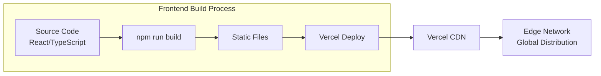
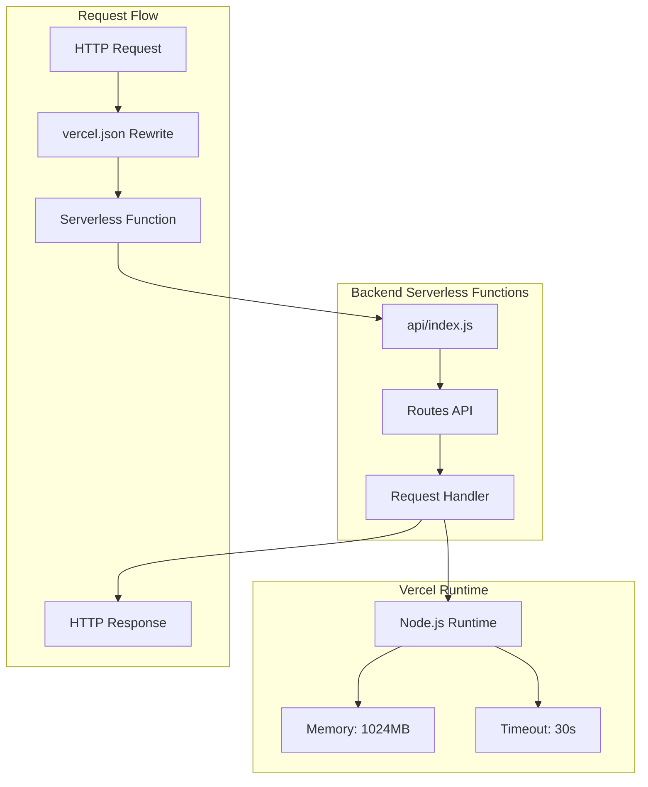
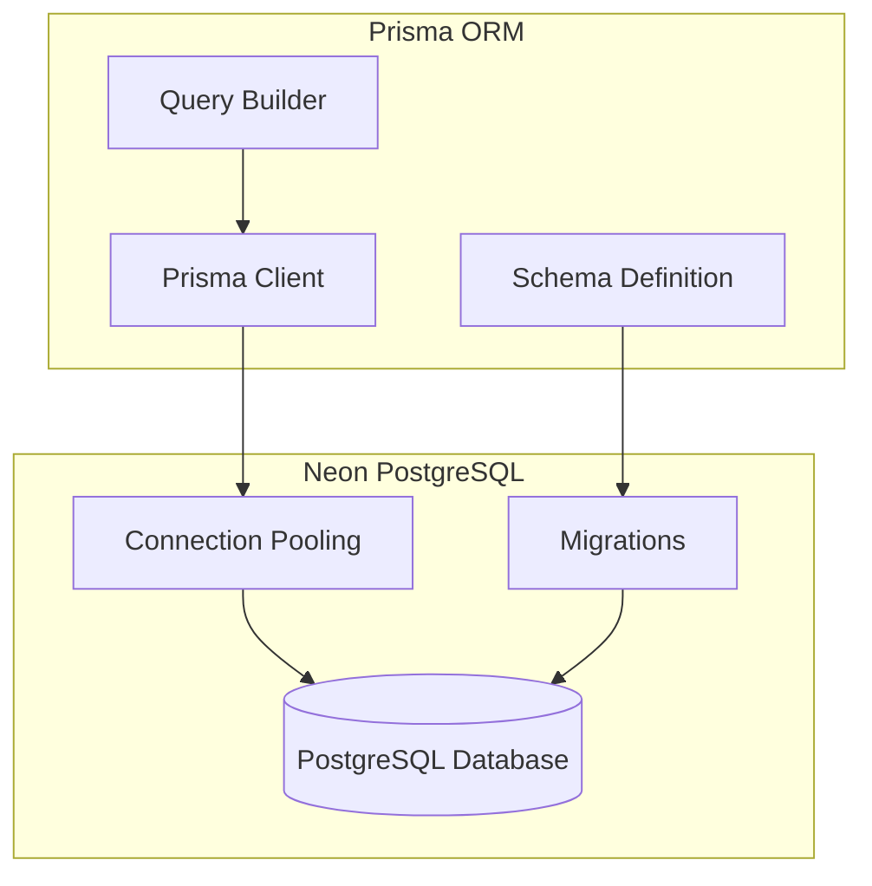
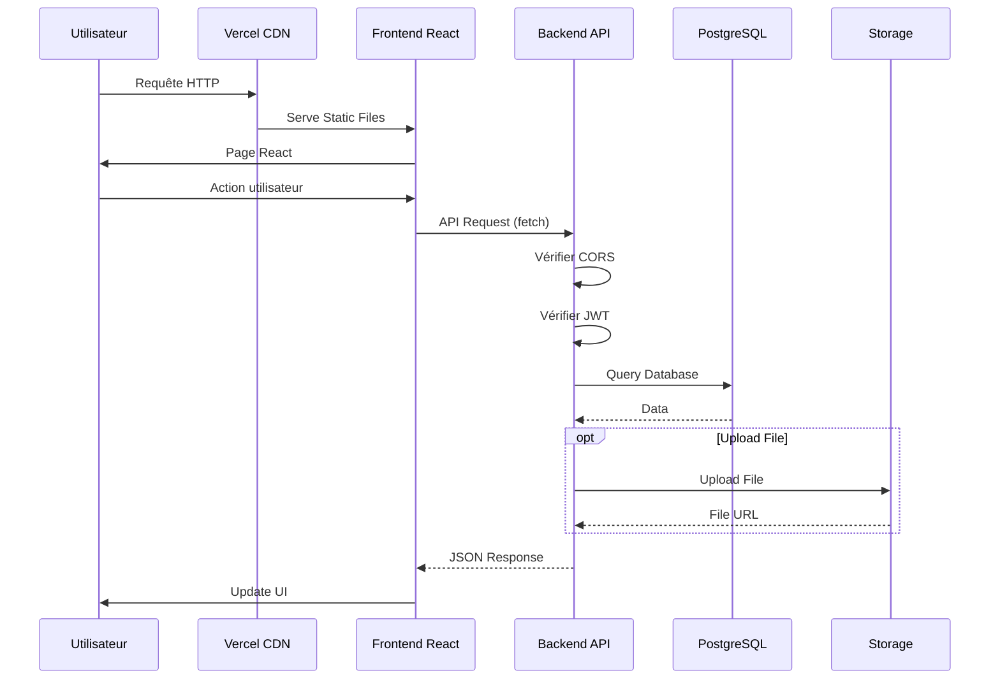

# Diagramme de Déploiement sur Vercel - Plateforme Coloc Antananarivo

## Architecture de Déploiement

```mermaid
graph TB
    subgraph "Internet"
        U1[Utilisateur 1]
        U2[Utilisateur 2]
        U3[Utilisateur N]
    end
    
    subgraph "Vercel Platform"
        subgraph "Frontend Deployment"
            FE1[Frontend React App]
            FE2[Static Assets]
            FE3[Build Files]
        end
        
        subgraph "Backend Deployment"
            BE1[Express API (Serverless)]
            BE2[API Routes]
            BE3[Upload Handler]
        end
        
        subgraph "Vercel Services"
            VS1[CDN]
            VS2[Edge Network]
            VS3[Function Runtime]
        end
    end
    
    subgraph "External Services"
        subgraph "Database"
            DB1[(PostgreSQL<br/>Neon Database)]
        end
        
        subgraph "Authentication"
            AUTH1[Clerk API<br/>Optional]
        end
        
        subgraph "Storage"
            ST1[Cloudinary Media CDN]
        end
    end
    
    U1 --> VS1
    U2 --> VS1
    U3 --> VS1
    
    VS1 --> FE1
    VS1 --> FE2
    VS1 --> FE3
    
    FE1 --> BE1
    FE1 --> BE2
    
    BE1 --> VS3
    BE2 --> VS3
    BE3 --> VS3
    
    VS3 --> DB1
    VS3 --> AUTH1
    VS3 --> ST1
    
    BE3 --> ST1
```

## Détails du Déploiement

### Frontend (Vercel)



**Configuration** :
- Framework : Create React App
- Build Command : `npm run build`
- Output Directory : `build`
- Environment Variables : `REACT_APP_API_URL`

### Backend (Vercel Serverless)



**Configuration** (`vercel.json`) :
```json
{
  "version": 2,
  "rewrites": [
    {
      "source": "/api/(.*)",
      "destination": "/api/index.js"
    }
  ],
  "functions": {
    "api/index.js": {
      "maxDuration": 30
    }
  }
}
```

### Base de Données



**Configuration** :
- Provider : Neon PostgreSQL
- Connection String : `DATABASE_URL` (env variable)
- Prisma Client : Généré automatiquement
- Migrations : Exécutées via Prisma

### Upload de Fichiers

```mermaid
graph LR
    subgraph "Upload Flow"
        CLIENT[Client Upload]
        API[Express Upload API]
        TMP[/tmp buffer]
        CLOUDINARY[(Cloudinary)]
        CDN[Cloudinary CDN]
    end
    
    CLIENT --> API
    API --> TMP
    TMP --> CLOUDINARY
    CLOUDINARY --> CDN
    CDN --> CLIENT
```

**Note** : Sur Vercel, les fichiers dans `/tmp` sont temporaires. Pour un stockage permanent, utiliser un service cloud.

## Variables d'Environnement

### Frontend
- `REACT_APP_API_URL` : URL de l'API backend

### Backend
- `DATABASE_URL` : URL de connexion PostgreSQL
- `JWT_SECRET` : Clé secrète JWT
- `CLOUDINARY_CLOUD_NAME` : Identifiant Cloudinary
- `CLOUDINARY_API_KEY` : Clé API Cloudinary
- `CLOUDINARY_API_SECRET` : Secret Cloudinary
- `NODE_ENV` : Environnement (production/development)
- `VERCEL` : Indicateur Vercel
- `VERCEL_ENV` : Environnement Vercel

## Flux de Requête Complet



## Points d'Attention

1. **Timeout** : Les fonctions serverless ont un timeout de 30 secondes (configurable)
2. **Cold Start** : Premier appel peut être plus lent
3. **Storage** : `/tmp` est temporaire, utiliser un service cloud pour les fichiers
4. **CORS** : Configuré dans `server.js` pour autoriser le frontend
5. **Database Connections** : Utiliser le connection pooling de Neon
6. **Environment Variables** : Configurées dans le dashboard Vercel

## URLs de Déploiement

- **Frontend** : `https://projet-stage-forntend.vercel.app`
- **Backend** : `https://projet-stage-backend.vercel.app`
- **API Base** : `https://projet-stage-backend.vercel.app/api`

