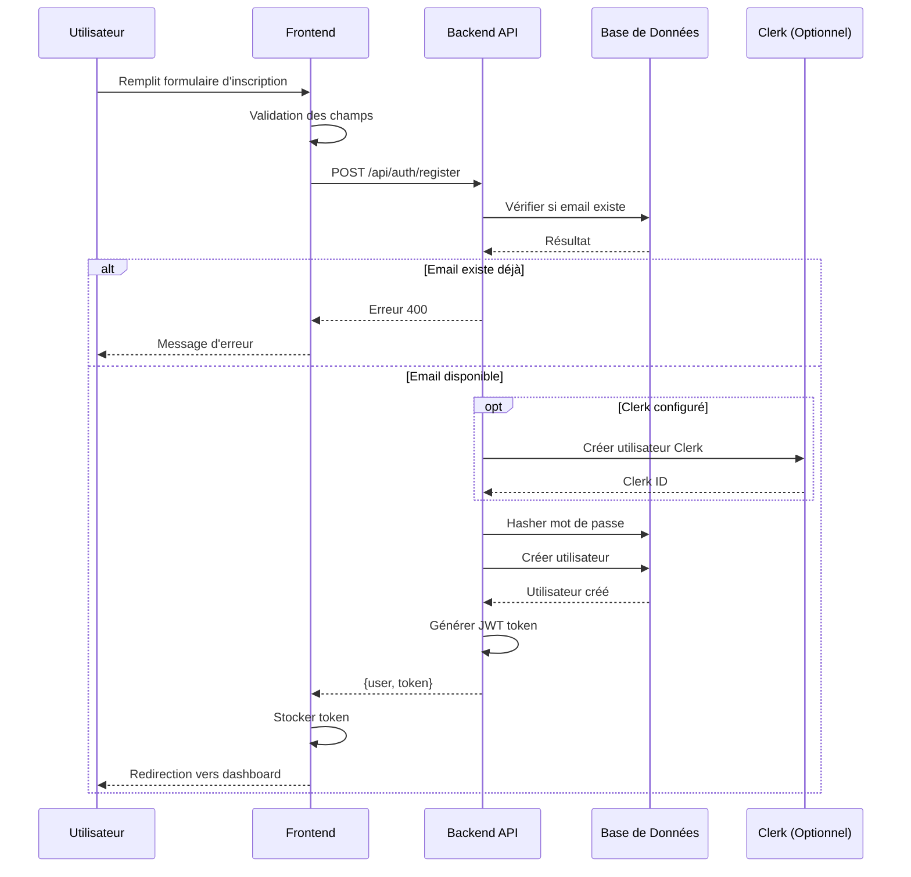
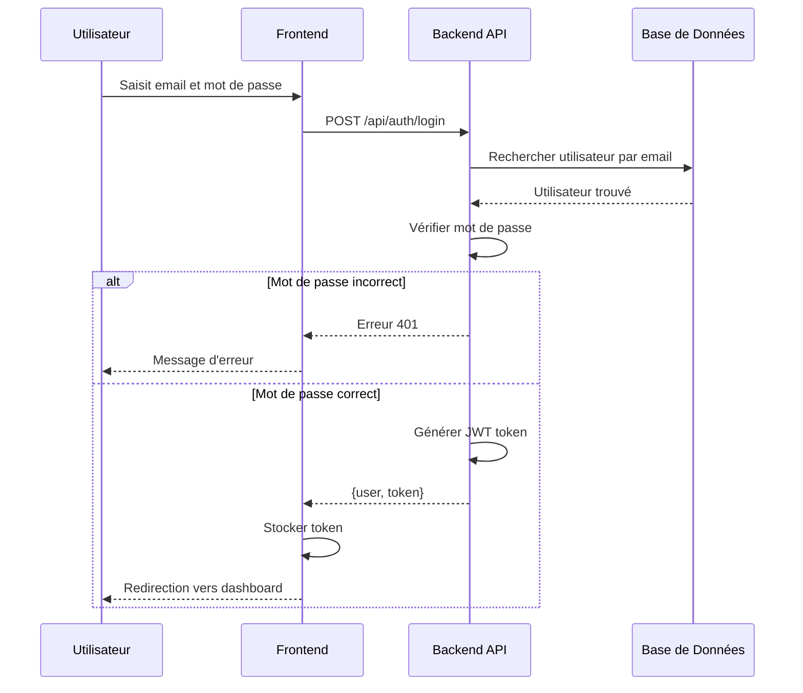
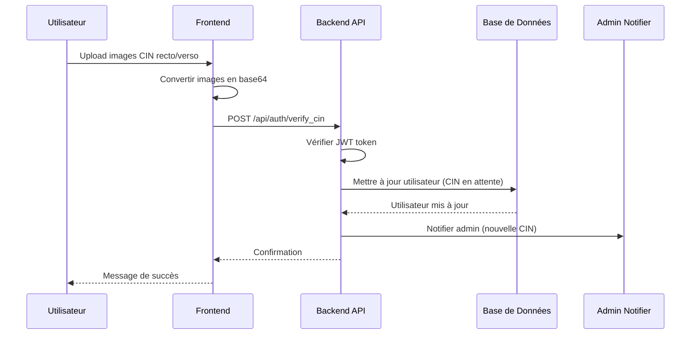
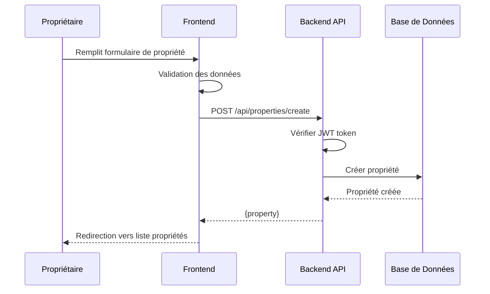
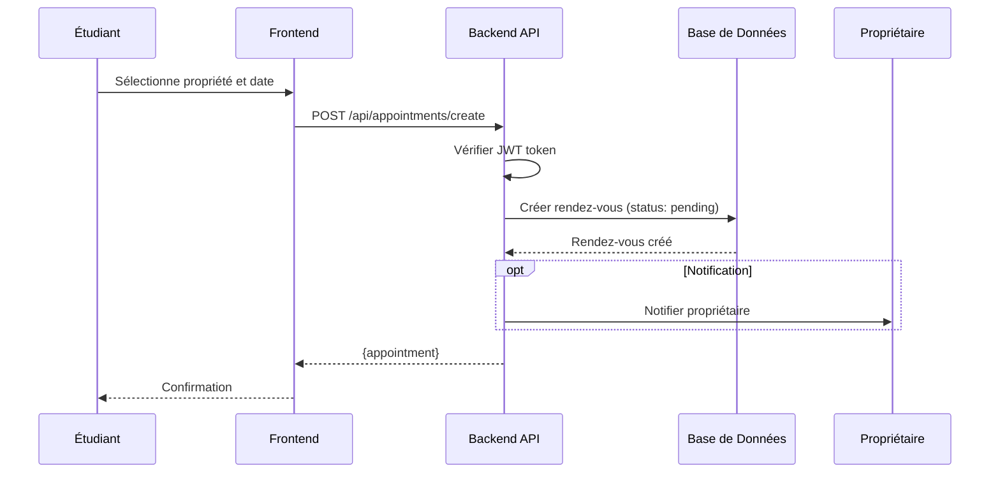
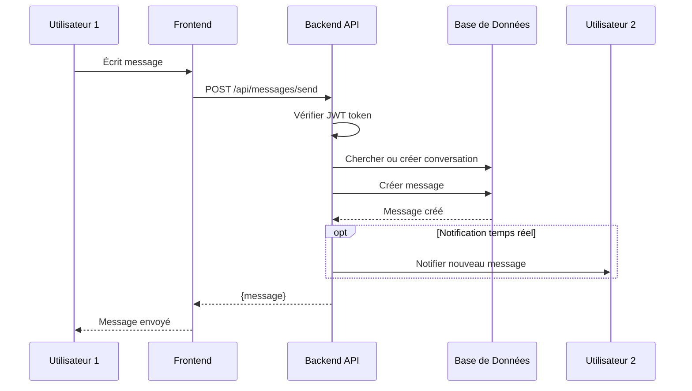
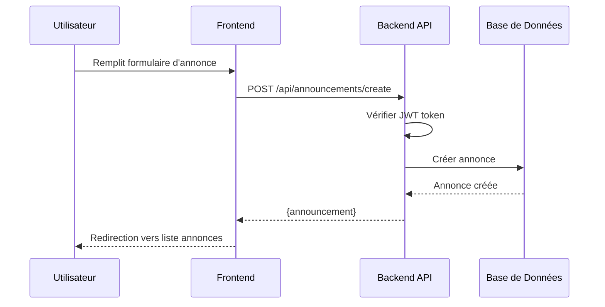
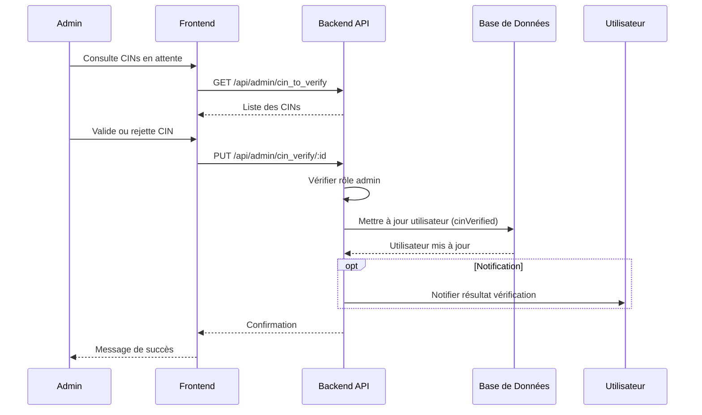
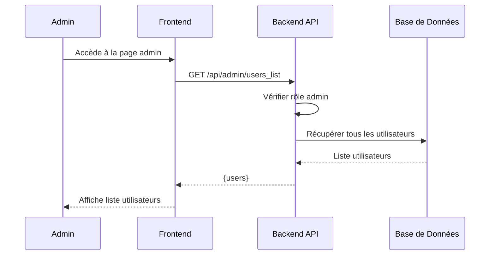
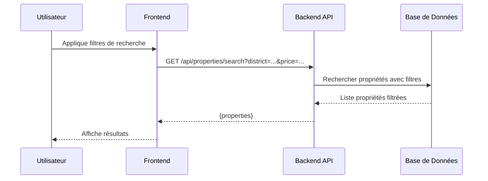

# Diagrammes UML de Séquence Générale - Plateforme Coloc Antananarivo

## UC1 - S'inscrire (POST /api/auth/register)

## UC2 - Se connecter (POST /api/auth/login)

## UC7 - Demander vérification CIN (POST /api/auth/verify_cin)

## UC12 - Publier logement (POST /api/properties/create)

## UC15 - Planifier visite (POST /api/appointments/create)

## UC17 - Messagerie directe (POST /api/messages/send)

## UC19 - Publier annonce (POST /api/announcements/create)

## UC8 - Valider/Rejeter CIN (PUT /api/admin/cin_verify/:id)

## UC23 - Gérer utilisateurs (GET /api/admin/users_list)

## UC10 - Rechercher propriétés (GET /api/properties/search)

