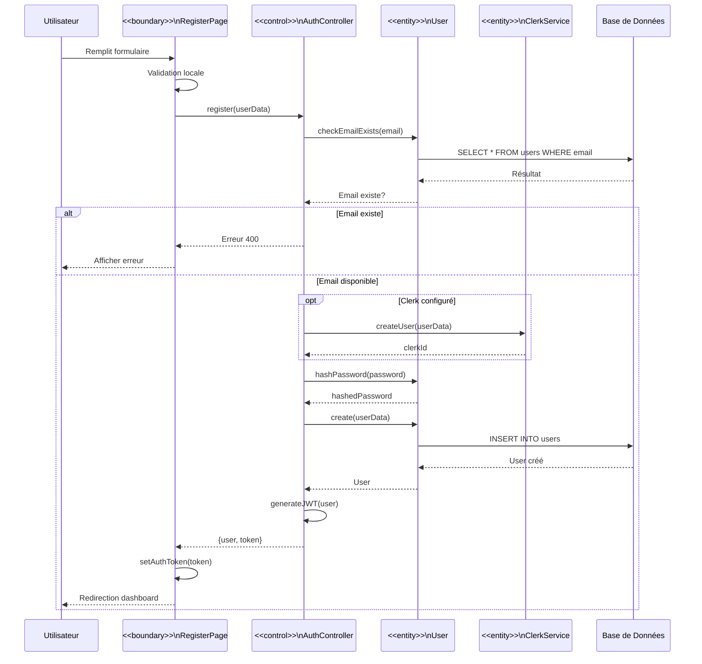
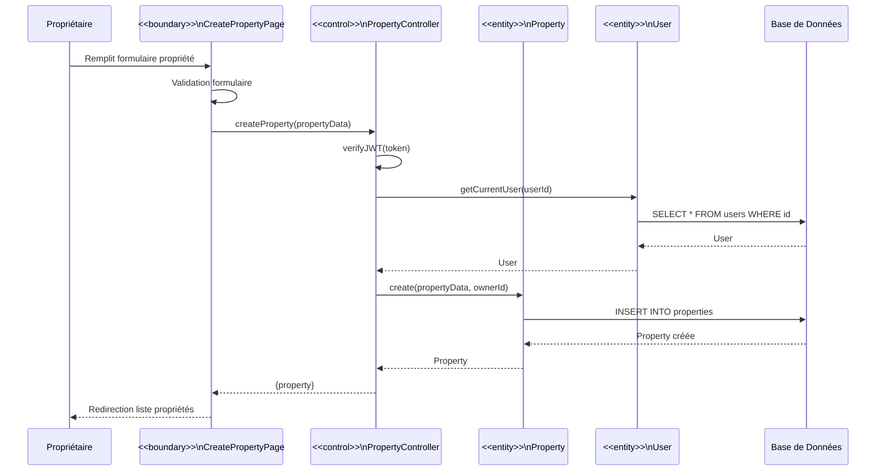
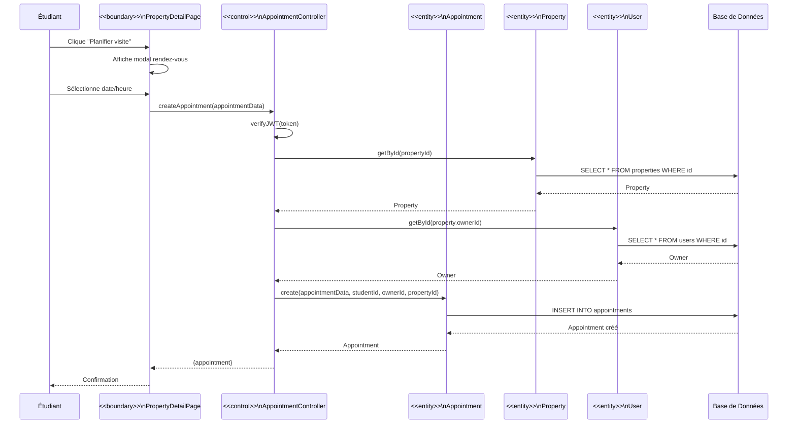
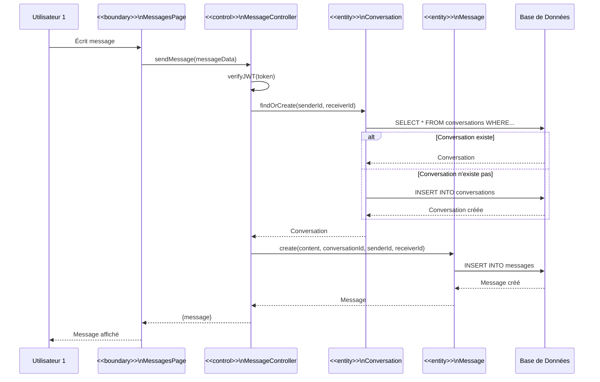
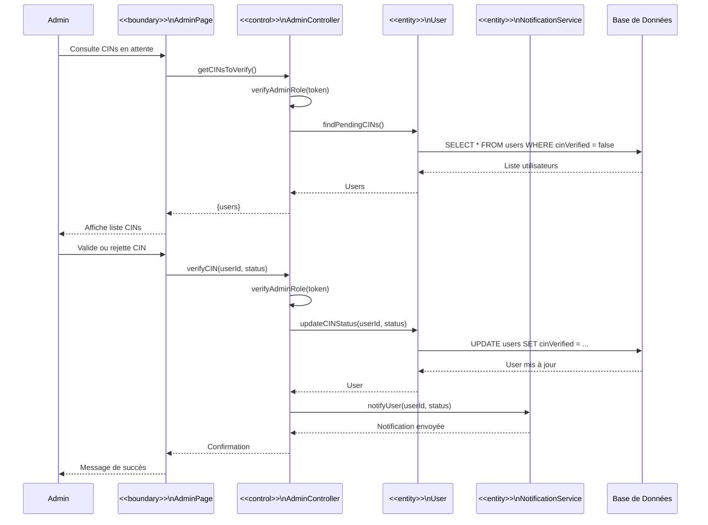
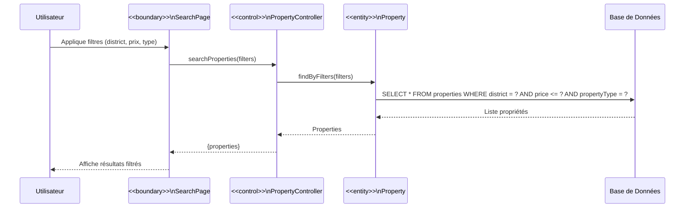
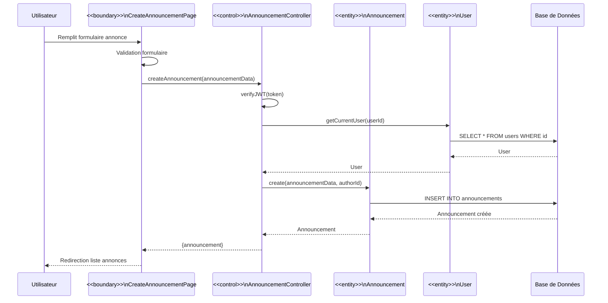
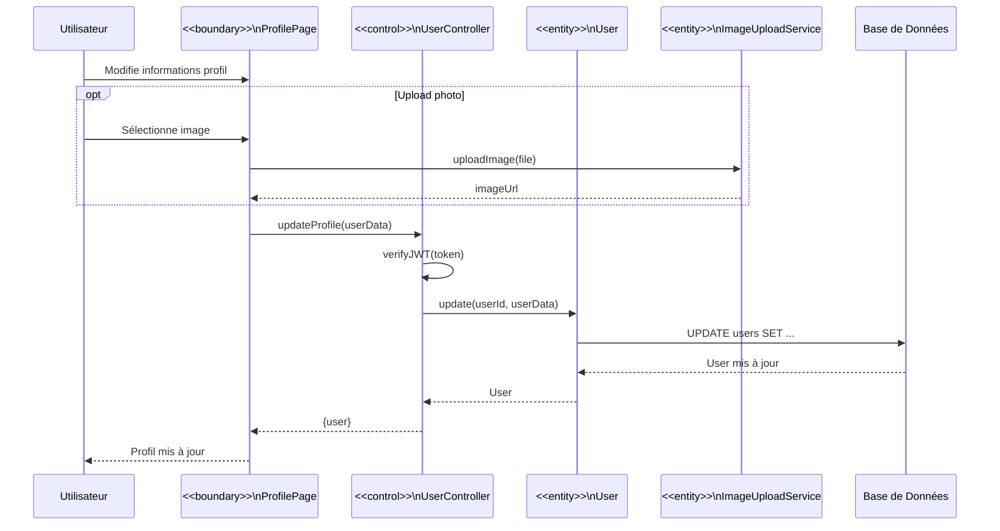

# Diagrammes UML de Séquence de Conception - Plateforme Coloc Antananarivo

## UC1 - S'inscrire (Conception)

## UC12 - Publier logement (Conception)

## UC15 - Planifier visite (Conception)

## UC17 - Messagerie directe (Conception)

## UC8 - Valider/Rejeter CIN (Conception)

## UC10 - Rechercher propriétés (Conception)

## UC19 - Publier annonce (Conception)

## UC5 - Modifier profil (Conception)

