# Diagrammes UML de la plateforme Coloc Antananarivo

Ce document regroupe les définitions PlantUML des principaux artefacts UML du projet. Vous pouvez générer des visuels à l'aide de [PlantUML](https://plantuml.com/) ou d'un outil compatible (ex. VSCode PlantUML, IntelliJ, CLI PlantUML + Graphviz).

> Exemple de génération :
> ```bash
> plantuml docs/uml_diagrams.md
> ```

## 1. Diagramme de cas d'utilisation

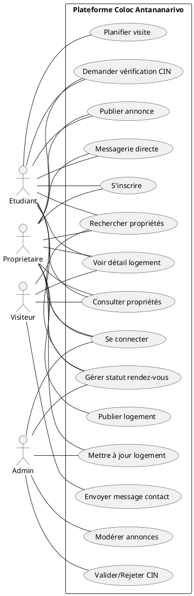

## 2. Diagrammes de séquence (fonctionnels & conception)

Chaque diagramme inclut des stéréotypes <<boundary>>, <<control>> et <<entity>>, ainsi que l'endpoint HTTP utilisé.

### 2.1 S'inscrire — `POST /api/auth/register`
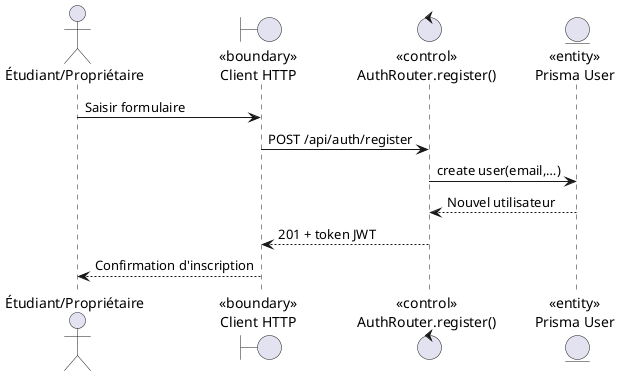

### 2.2 Se connecter — `POST /api/auth/login`
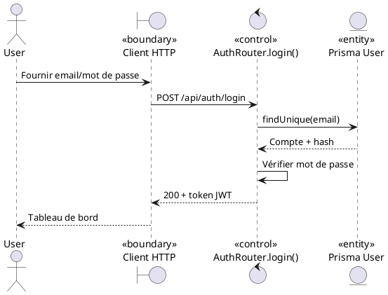

### 2.3 Demander vérification CIN — `POST /api/auth/verify_cin`
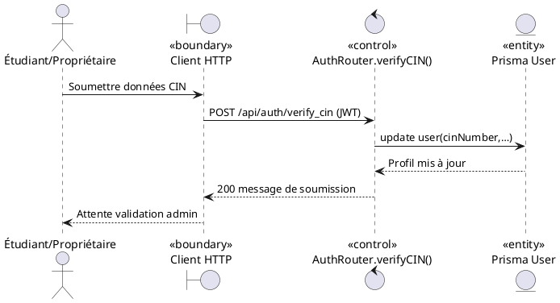

### 2.4 Valider/Rejeter CIN — `PUT /api/admin/cin_verify/:id`
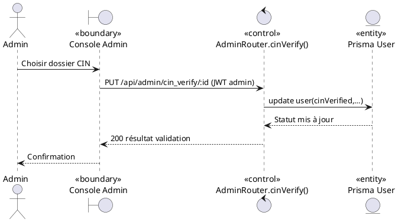

### 2.5 Consulter propriétés — `GET /api/properties/get_all`
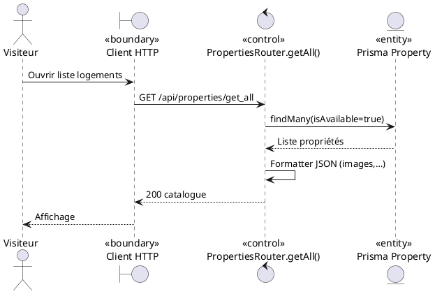

### 2.6 Rechercher propriétés — `GET /api/properties/search`
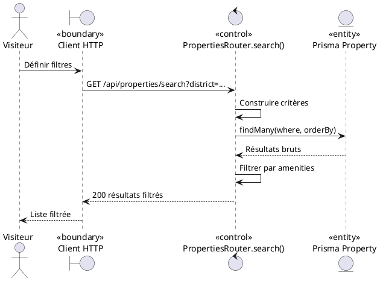

### 2.7 Voir détail logement — `GET /api/properties/get_by_id/:id`
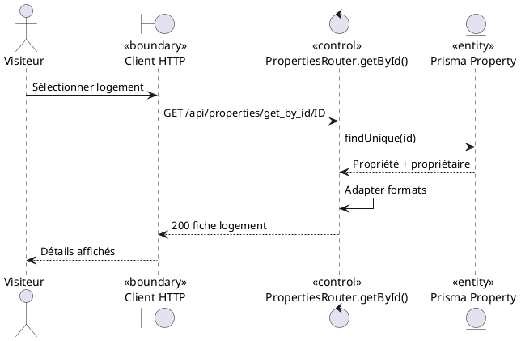

### 2.8 Publier un logement — `POST /api/properties/create`
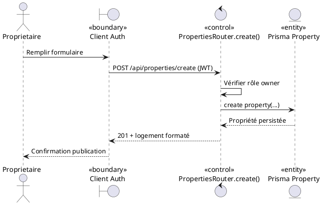

### 2.9 Mettre à jour un logement — `PUT /api/properties/update/:id`
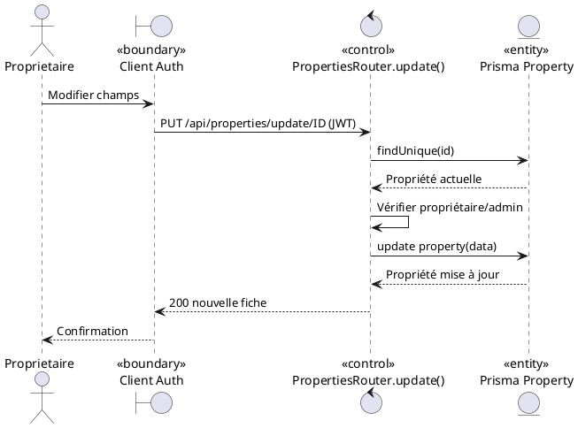

### 2.10 Planifier une visite — `POST /api/appointments/create`
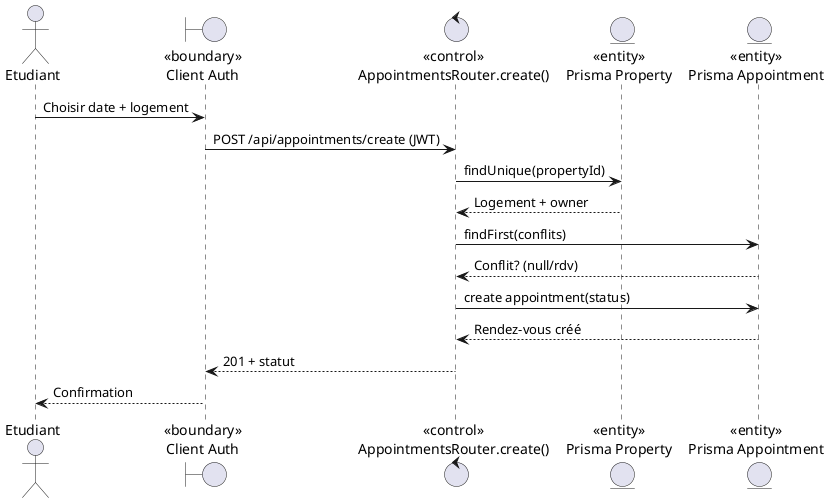

### 2.11 Gérer statut rendez-vous — `PUT /api/appointments/update_status/:id`
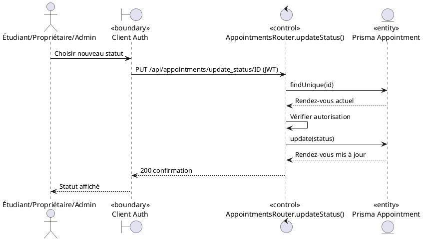

### 2.12 Messagerie directe — `POST /api/messages/send`
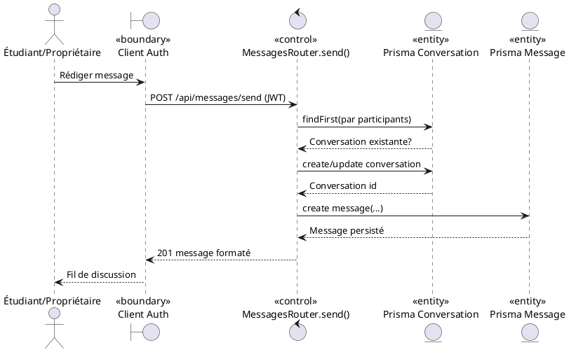

### 2.13 Envoyer message de contact — `POST /api/contacts/send`
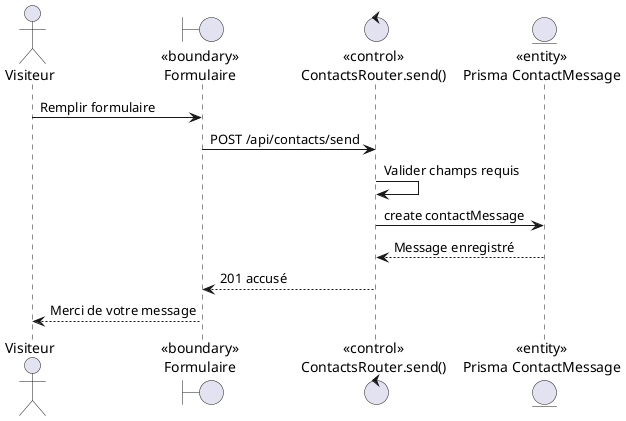

### 2.14 Publier une annonce — `POST /api/announcements/create`
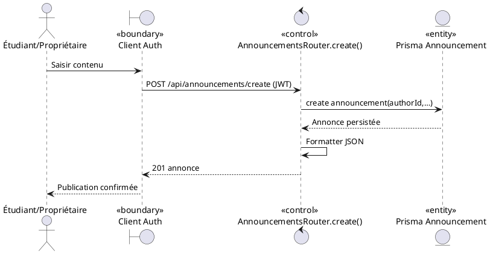

### 2.15 Modérer les annonces — `PUT /api/announcements/update/:id` / `DELETE`
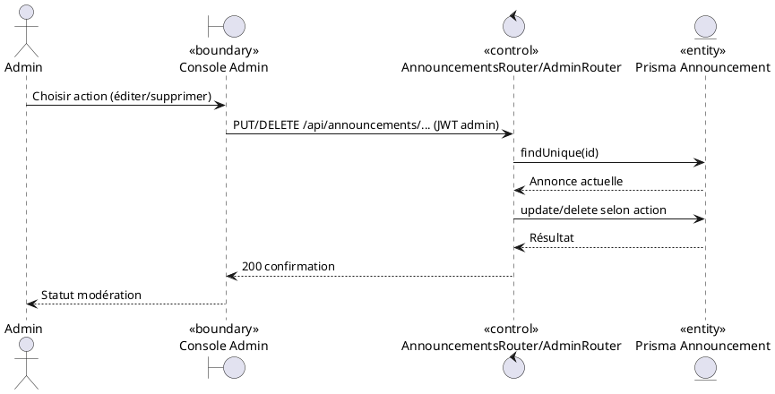

## 3. Modèle de domaine

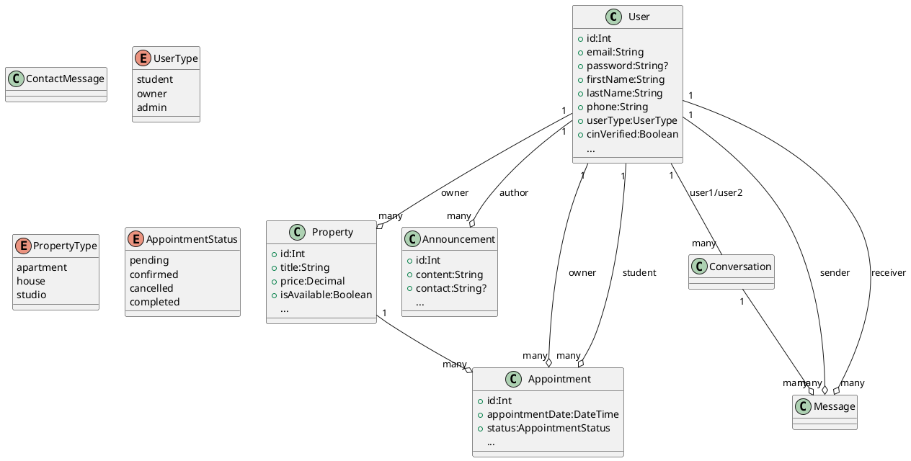

## 4. Diagramme de paquetages

```plantuml
@startuml
package Frontend {
  package "React App" {
    [Pages]
    [Contexts]
    [Services]
  }
}

package Backend {
  package "Express Server" {
    package Routes {
      [Auth]
      [Properties]
      [Announcements]
      [Appointments]
      [Messages]
      [Contacts]
      [Admin]
      [Users]
    }
    package Utils {
      [auth.js]
      [response.js]
      [adminNotifier.js]
    }
  }
  package "Prisma ORM" {
    [Client]
    [Schema]
  }
}

package "External Services" {
  [PostgreSQL DB]
  [Clerk API]
}

Frontend --> Backend : Requêtes REST
Backend::Routes --> Backend::Utils
Backend::Express Server --> Prisma ORM
Prisma ORM --> "PostgreSQL DB"
Backend::Utils --> "Clerk API"
@enduml
```

## 5. Diagramme de déploiement

```plantuml
@startuml
node "Utilisateur" {
  device "Navigateur" {
    artifact "Frontend React\n(http://localhost:3000)" as Frontend
  }
}

node "Serveur d'applications" {
  node "Node.js Express" {
    artifact "Backend API\n(http://localhost:5000)" as Backend
  }
}

node "Infrastructure données" {
  database "PostgreSQL" as DB
  node "Stockage fichiers" as Storage
}

node "Service tiers" {
  artifact "Clerk Identity" as Clerk
}

Frontend --> Backend : HTTPS REST
Backend --> DB : Connexion Prisma
Backend --> Storage : Uploads (/uploads)
Backend --> Clerk : Vérification token
@enduml
```
